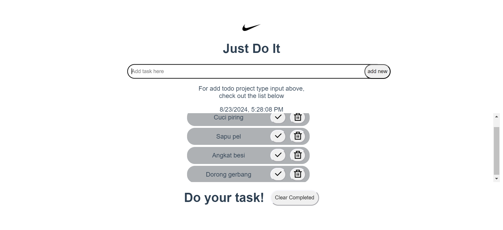
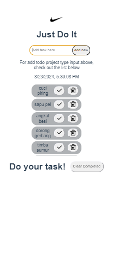

# wisata-app todo-project

## Project explanation

```
This is a todo project with simple instruction and can display and add and also edit the data
```

### Features of todo list:

```
- Easy to use
- Maintain balance
- Displays current date and time
- Responsive on all device
- Can be edited and deleted
```

### Features to be updated

```
- Add subtasks
- Can use scratch pad
- Login features & databases
- Reminder and alerts
```

### References

```
- vue js
- tailwindcss
- remixicon
```

### Contribution and website demo

See the pictures below for the contributon and the demo.




